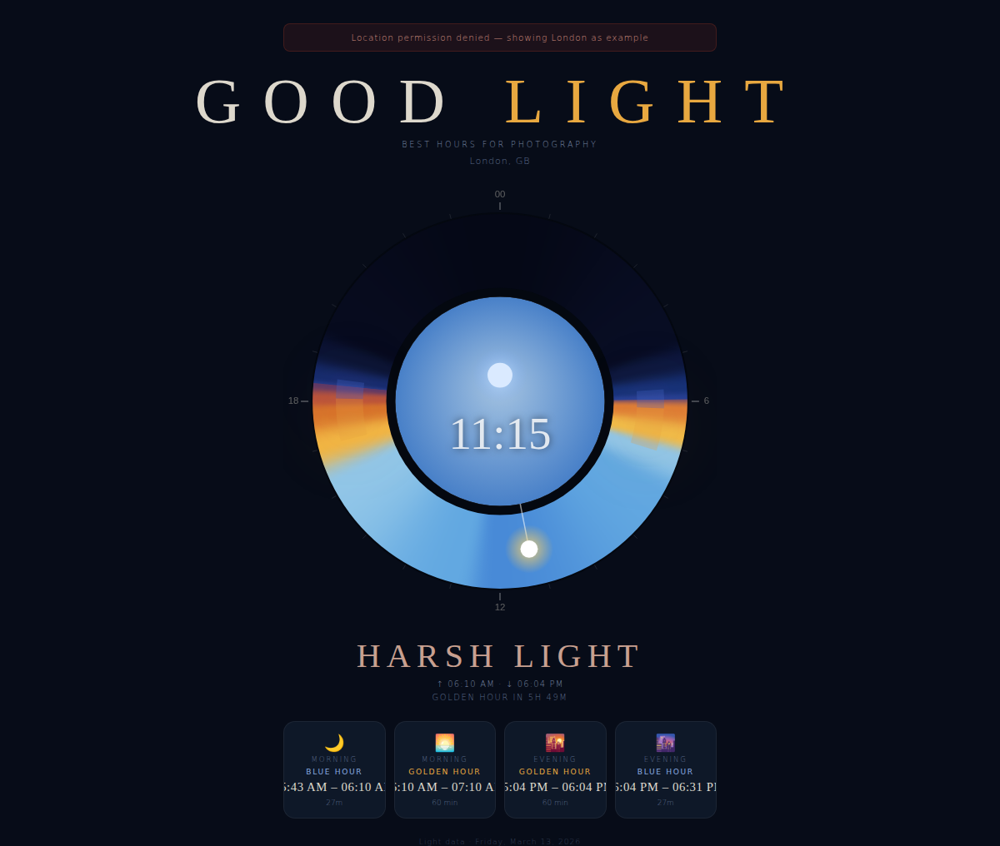

# good_light

A creative web app that tells you the **best hours for photography** based on your current location — when light is low on the sky and beautifully soft (golden hour & blue hour).

## Features

- 📍 **Geolocation** — automatically detects your position
- 🌅 **Real solar data** — fetches precise sunrise/sunset/twilight times from [api.sunrise-sunset.org](https://sunrise-sunset.org/api) (free, no API key needed)
- 🎨 **Light Wheel** — a 24-hour circular canvas visualization painted with the actual sky colours for each minute of the day; glowing arcs highlight golden hour and blue hour windows
- ⏱ **Live indicator** — a glowing needle shows the current time on the ring; the centre circle animates to match the current sky (warm gold tones, cool blue, night sky with stars/moon)
- 🗓 **Schedule cards** — Morning Blue Hour, Morning Golden Hour, Evening Golden Hour, Evening Blue Hour, all with exact local times
- 🔢 **Countdown** — shows how long until the next best light window
- 🌍 **Fallback** — if location is denied, defaults to London so the app is always functional

## Screenshot

## Live demo

Deployed to GitHub Pages: [https://nombrekeff.github.io/good_light/](https://nombrekeff.github.io/good_light/)

## Deployment

The included GitHub Actions workflow (`.github/workflows/deploy.yml`) automatically deploys the `main` branch to GitHub Pages on every push.

Enable Pages in your repository settings → **Pages → Source → GitHub Actions** and the workflow will handle the rest.

## Tech stack

Pure HTML / CSS / Canvas — no build step, no dependencies, no API key required.
